-– output: github_document —

## The Relationship between COVID and GA Bond Yields

### What happened to yields during COVID

In March of 2020, municipal bond yields spiked, in many cases increasing
over a thousand percent. Conditions deteriorated to the point where Kent
Hiteshew, Deputy Associate Director of the Federal Reserve’s Division of
Financial Stability, said that “state and local governments were
effectively unable to borrow.” Yields stabilized and fell below
pre-pandemic levels over the next few months, with research strongly
suggesting that the CARES act and a variety of actions by the Federal
Reserve played a large part.

These yields are important because they, in a way, estimate the
real-time health of a municipal bond. When a county wants to build a new
sports stadium, they finance it by issuing bonds. They, in effect, take
out hundreds of thousands of small loans from investors (which are
called bonds in this context) and agree to pay interest (the coupon)
every year over the life of the bond.

The coupon is fixed when the debt is issued, so the coupon doesn’t tell
us anything about the current health of the bond, just the expected
future health of the bond at the time of issuance. Instead, analysts use
the yield as the best estimate of what the current coupon would be. This
matters, because when yields spike, it tells us the issuer’s financial
health is worse than it was before.

Coupons represent the extra interest payments owed on municipal debts,
and so they’re the primary focus of our work. However, the yield on a
municipal bond is often used as a proxy for what the market estimates
the real-time interest of a bond to be. While that interetpretation may
fail on various grounds, the yield nonetheless tells us a lot about the
health of a bond, and therefore the health of the entity that issued it.

### Data

Our analysis is based off of two principal sources of data: the
Municipal Securities Rulemaking Board (MSRB) collection of municipal
data and the S&P Global Ratings metadata on bond issuances. We were
awarded grants by the Pulitzer Center and the Columbia University’s
Brown Institute for Media Innovation, which we used to purchase access
to these data sources. The MSRB is the regulatory body in charge of
overseeing municipal securities in the United States. The S&P is a
credit-rating agency that serves as the formal issuer of identification
numbers for securities (municipal and otherwise). We collect trade
information from the MSRB that contains all purchases and sales of
municipal securities between October 10th 2019 and October 10th 2021.
These data include transaction characteristics such as price, time, and
yield, as well as other metadata relevant to the security such as credit
rating of the issuer and whether the issue was a negotiated or
competitive sale. We also collect data on new issuances from the MSRB.
These data form a full record of all fixed-rate municipal securities
issued in the state of Georgia between 2018 and 2021. They include the
same data on issuance as the transaction data.

We clean the data and derive a number of liquidity proxy variables
following Schwert (2017). The major steps in data cleaning involve
eliminating such bonds with too few trades during the sample period,
variable coupon rates, and negative or extreme coupon rates. Using this
data, we examine the relationship between COVID in the the state of
Georgia and the financial obligations of bond issuers.

``` r
cusip_keep<-D_amihud_final_2 %>% group_by(cusip) %>% summarise(n = n()) %>% filter(n > 0) %>% pull(cusip)


D_amihud_final_2%>% filter(cusip%in%cusip_keep) %>%  
  ggplot(aes(x = trade_month, y = yield %>% as.numeric, group= cusip))+
  geom_line(alpha = .05)+theme(legend.position = "none")+ylim(0,10) +bbc_style()
```

    ## Warning: Removed 493 row(s) containing missing values (geom_path).

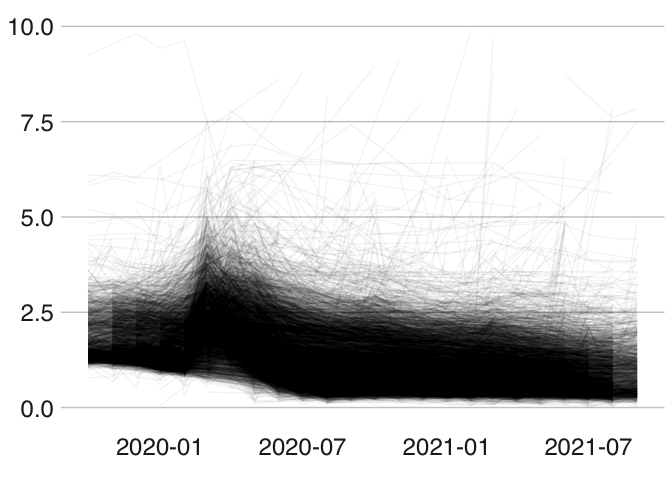<!-- -->

Bond spreads–the difference between the yield on a bond and the yield on
an appropriate Treasury bond–despite having recovered significantly from
their March/April 2020 peak show less recovery than yields. These bond
spreads are often considered a better measure of the health of a bond,
especially when considering the risk of default.

``` r
cusip_keep<-D_amihud_final_2 %>% group_by(cusip) %>% summarise(n = n()) %>% filter(n > 0) %>% pull(cusip)


D_amihud_final_2%>% filter(cusip%in%cusip_keep) %>%  
  ggplot(aes(x = trade_month, y = spread %>% as.numeric, group= cusip))+
  geom_line(alpha = .1)+theme(legend.position = "none")+ylim(-1,10)+bbc_style()
```

    ## Warning: Removed 599 row(s) containing missing values (geom_path).

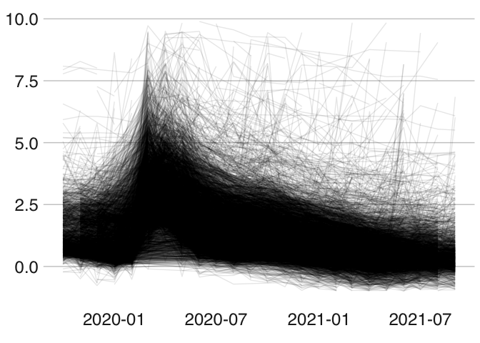<!-- -->

More specifically, of the 3,088 Georgia municipal bonds we track both
before and after the pandemic, 2,696 (87%) of them have seen yields
recover, while 2285 (74%) have seen their spreads recover. This
distinction is what animated much of the CARES Act Congressional
Oversight Committee’s argument on whether to shutter the Municipal
Liquidity Facility (MLF), as they eventually did in December 2020. The
Democratic faction of the Committee argued that lower but elevated
spreads showed that while the MLF had succeeded in its initial goal of
stabilizing municipal markets, there was still work to be done, while
the Republican faction argued that lower yields showed there was no need
for more municipal support.

``` r
cutoff<-as.numeric(ymd("2020-02-01"))

pre_data<-D_amihud_final_2 %>% mutate(when = ifelse(time_numeric>cutoff, "after_pan","before_pan")) %>% 
  filter(when=="before_pan") %>%  group_by(cusip) %>% 
  summarise(max_date = max(trade_month), which_max_trade = which.max(trade_month),
            max_yield_before = yield[which_max_trade],
            max_spread_before = spread[which_max_trade],
            GEOID = GEOID[1],
            sec_desc_class=sec_desc_class[1],
            sec_desc = sec_desc[1])

post_data<-D_amihud_final_2 %>% mutate(when = ifelse(time_numeric>cutoff, "after_pan","before_pan")) %>% 
  filter(when=="after_pan") %>%  group_by(cusip) %>% 
  summarise(min_yield_after = min(yield),min_spread_after = min(spread), last_sale = max(trade_month))

never_recovered<-pre_data %>% left_join(post_data, by = "cusip")  %>% 
  mutate(diff_spread=(min_spread_after-max_spread_before),
         diff_yield=(min_yield_after-max_yield_before),
         perc_diff_yield=(min_yield_after-max_yield_before)/max_yield_before,
         perc_diff_spread=(min_spread_after-max_spread_before)/max_spread_before) %>% 
  mutate(spread_rec = ifelse(perc_diff_spread<.1,"recovered","not_recovered"),
         yield_rec = ifelse(perc_diff_yield<.1,"recovered","not_recovered")
         )

(never_recovered %>% filter(yield_rec=="recovered") %>% nrow)/(never_recovered %>% nrow)
```

    ## [1] 0.8800366

``` r
(never_recovered %>% filter(spread_rec=="recovered") %>% nrow)/(never_recovered %>% nrow)
```

    ## [1] 0.7432845

However, for both yields and spreads, bonds have recovered more in some
counties than others. About half of the counties in Georgia have no
bonds with elevated yields, while other counties see elevated yields far
more frequently.

``` r
never_recovered<-pre_data %>% left_join(post_data, by = "cusip")  %>% 
  mutate(diff_spread=(min_spread_after-max_spread_before),
         diff_yield=(min_yield_after-max_yield_before),
         perc_diff_yield=(min_yield_after-max_yield_before)/max_yield_before,
         perc_diff_spread=(min_spread_after-max_spread_before)/max_spread_before) %>% 
  mutate(spread_rec = ifelse(perc_diff_spread<0,"recovered","not_recovered"),
         yield_rec = ifelse(perc_diff_yield<0,"recovered","not_recovered")
         )

never_rec_yield<-never_recovered %>% filter(yield_rec=="not_recovered", last_sale > ymd("2021-01-01")) %>% pull(cusip)
never_rec_spread<-never_recovered %>% filter(spread_rec=="not_recovered", last_sale > ymd("2021-01-01")) %>% pull(cusip)

#this is to look by county
grouped_never_rec<-D_amihud_final_2 %>% mutate(trade_m = as.numeric(trade_month)) %>%  select(GEOID, cusip, sec_desc) %>% distinct %>% group_by(GEOID) %>% 
  summarise(never= length(which(cusip%in%never_rec_spread)),
            never_sec= length(unique(sec_desc[which(cusip%in%never_rec_spread)])),
            n_sec = length(unique(sec_desc)),
            perc_sec_never = never_sec/n_sec,
            n=n(),
            perc_never=never/n,
            sec_desc = list(sec_desc)) %>% arrange(desc(perc_never)) %>% 
  mutate(GEOID = as.character(GEOID)) %>% 
  left_join(GA_census_tract_data %>% select(GEOID, NAME), by = "GEOID") %>% arrange(desc(perc_sec_never))

grouped_never_rec %>% arrange(desc(perc_never), desc(n)) 
```

    ## # A tibble: 116 x 9
    ##    GEOID never never_sec n_sec perc_sec_never     n perc_never sec_desc  NAME   
    ##    <chr> <int>     <int> <int>          <dbl> <int>      <dbl> <list>    <chr>  
    ##  1 13131     1         1     1          1         1      1     <chr [1]> Grady …
    ##  2 13035     2         2     2          1         3      0.667 <chr [3]> Butts …
    ##  3 13169     2         1     1          1         4      0.5   <chr [4]> Jones …
    ##  4 13231     2         1     1          1         4      0.5   <chr [4]> Pike C…
    ##  5 13081     3         1     1          1        10      0.3   <chr [10… Crisp …
    ##  6 13217     4         4     6          0.667    14      0.286 <chr [14… Newton…
    ##  7 13211     2         2     2          1         7      0.286 <chr [7]> Morgan…
    ##  8 13305     2         2     2          1         8      0.25  <chr [8]> Wayne …
    ##  9 13047     1         1     1          1         4      0.25  <chr [4]> Catoos…
    ## 10 13149     1         1     1          1         4      0.25  <chr [4]> Heard …
    ## # … with 106 more rows

``` r
#we can also look by issuer
grouped_never_rec<-D_amihud_final_2 %>% mutate(trade_m = as.numeric(trade_month),issuer_n = str_sub(cusip,1,6))%>%  
  select(issuer_n, cusip, sec_desc, GEOID) %>% distinct %>% group_by(issuer_n) %>% 
  summarise(never= length(which(cusip%in%never_rec_yield)),
            never_sec= length(unique(sec_desc[which(cusip%in%never_rec_yield)])),
            n_sec = length(unique(sec_desc)),
            perc_sec_never = never_sec/n_sec,
            n=n(),
            perc_never=never/n,
            sec_desc = list(sec_desc),
            GEOID = GEOID[1]) %>% arrange(desc(perc_never)) %>% 
  mutate(GEOID = as.character(GEOID)) %>% 
  left_join(GA_census_tract_data %>% select(GEOID, NAME), by = "GEOID") %>% arrange(desc(perc_sec_never))

grouped_never_rec%>% arrange(desc(perc_never), desc(n)) 
```

    ## # A tibble: 438 x 10
    ##    issuer_n never never_sec n_sec perc_sec_never     n perc_never sec_desc GEOID
    ##    <chr>    <int>     <int> <int>          <dbl> <int>      <dbl> <list>   <chr>
    ##  1 36274P       2         1     1          1         2     1      <chr [2… 13139
    ##  2 04781G       1         1     1          1         3     0.333  <chr [3… 13121
    ##  3 26114C       1         1     1          1         3     0.333  <chr [3… 13121
    ##  4 652577       1         1     2          0.5       3     0.333  <chr [3… 13217
    ##  5 226688       3         1     1          1        10     0.3    <chr [1… 13081
    ##  6 721115       1         1     1          1         4     0.25   <chr [4… 13231
    ##  7 05115C       2         1     1          1        12     0.167  <chr [1… 13245
    ##  8 243039       1         1     1          1         8     0.125  <chr [8… 13087
    ##  9 04777L       1         1     2          0.5      12     0.0833 <chr [1… 13121
    ## 10 12033R       1         1     3          0.333    13     0.0769 <chr [1… 13031
    ## # … with 428 more rows, and 1 more variable: NAME <chr>

``` r
D_issues %>% filter(desc=="MONROE COUNTY PUBLIC FACILITIES AUTHORITY, GEORGIA / REVENUE BONDS (GOVERNMENTAL PROJECTS) SERIES 2020" ) %>% mutate(true_coupon = principal_amount_at_issuance/(dollar_price)*(coupon)/principal_amount_at_issuance, true_amount = principal_amount_at_issuance/dollar_price*100, ttm=(maturity_date - dated_date)/365, ttm = round(ttm,0)) %>% select(true_coupon, true_amount, dated_date, ttm) %>% mutate(k=true_amount*.012*ttm) %>% summarise(sum(k))
```

    ## # A tibble: 1 x 1
    ##   `sum(k)`    
    ##   <drtn>      
    ## 1 2513811 days

### Modeling

We want to estimate whether and the degree to which COVID was associated
with an increase to the actual dollar cost that issuing entities must
pay over time. To estimate that increase, we need to examine how coupon
rates changed during the pandemic.

One important caveat is that municipal bond issuers don’t pay interest
on the stated amount of a bond, what’s known as the face value of the
bond. For reasons specific to the bond market, bonds are issued either
above or below par (a value relative to 100, where bonds “priced” above
100 are said to be priced over par while bonds “priced” below 100 are
said to be under par). One can, however, using the total dollar amount
of bond issuance, the par pricing, and the face coupon, work backwards
to determine the actual interest rate municipalities pay on the actual
dollar value of their debt. We call this figure the true coupon, and
treat this as our dependent variable, following conversations with bond
analysts and underwriters. From now on, whenever we refer to coupons, we
mean true coupons.

``` r
D_plot<-D_now  %>% mutate(issue_date_p = issue_date_d) %>% filter(issue_date>as.numeric(ymd("2018-01-01")))

D_plot %>% ggplot(aes(x = issue_date_d, y = true_coupon*100))+geom_point()+geom_smooth()+geom_vline(xintercept=ymd("2020-03-01"))+geom_vline(xintercept=ymd("2020-11-01"))+xlab("Date")+ylab("Coupon")+bbc_style()
```

    ## `geom_smooth()` using method = 'gam' and formula 'y ~ s(x, bs = "cs")'

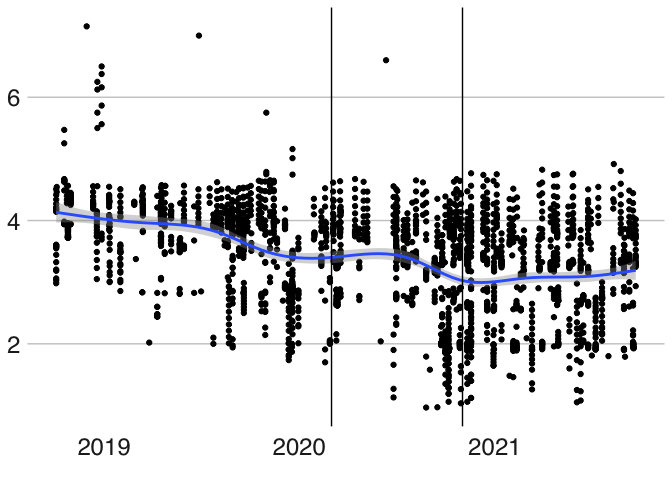<!-- -->

What we see is that coupons had been steadily declining since 2018. We
see an increase in average coupons right around the beginning of COVID
and a drop in the coupon shortly afterwards. This drop continues until
the beginning of the largest wave of COVID in Georgia and in the U.S,
when it begins to increase. This seems strange, but it’s consistent with
prior research (Bi, 2021) giving evidence that the Federal Reserve’s
monetary policy and Congress’ fiscal policy helped stabilize the
municipal market in the early part of the recession, but that COVID
rates affected long-term credit concerns.

As long-term concerns over a continuing pandemic take precedent over
past stimulus, issuers begin increasing rates to attract investors, a
suggestion initially made in (Bi, 2021). While a benefit to investors,
increased coupon rates at issuance represent real extra dollars
municipalities must pay in interest.

We can use a regression discontinuity design to formalize this intuition
and account for covariates. Regression discontinuity is a
quasi-experimental design type intended to allow for causal inference
about a treatment effect. Of quasi-experimental post-treatment designs,
it is regarded as providing the best estimates of the local treatment
effect.

A regression discontinuity design aims to choose a variable along which
there is a “discontinuity” related to the treatment. That is, some
variable across which the individuals being studied are similar, except
for the treatment. Here, we use time. The intuition is that bond issuers
issuing bonds on March 10th 2020 are extremely similar to bond issuers
issuing bonds on March 28th 2020, except for the fact the March 28th
issuers are living in a post-COVID world. If there are significant
differences in the characteristics of the bonds those two groups issue,
they’re likely caused by COVID.

``` r
#we impute missing variables to keep as many cusips as possible

#regression discontinuity to check the robustness of the effect. this estimate the pre-post as .5%
coup = D_now$true_coupon*100
dates= D_now$issue_date_d %>% as.numeric

gam_re_coup_rdd<-rdrobust(y = coup, x =dates,c = as.numeric(ymd("2020-03-17")),
                          
                          covs =D_now %>%
                            select(principal_amount_at_issuance,price_perc,total_agi,ttm,TB4WK,I_s),
                          stdvars = TRUE,
                          all =TRUE
            )
```

    ## [1] "Mass points detected in the running variable."

``` r
rd_plot<-rdplot(y = coup, x =dates,  c = as.numeric(ymd("2020-03-17")),binselect="qs",
                          covs = D_now %>%
                            select(principal_amount_at_issuance,price_perc,total_agi,ttm,TB4WK,I_s),
       y.lim = c(0,6)
            )
```

    ## [1] "Mass points detected in the running variable."

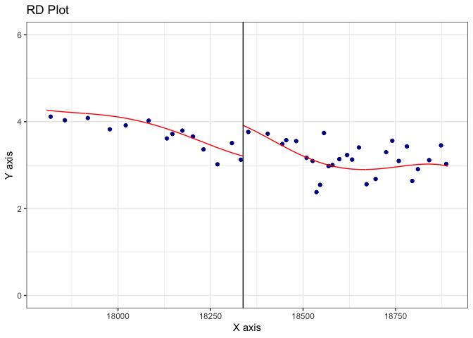<!-- -->

``` r
rdplot_mean_bin = rd_plot$vars_bins[,"rdplot_mean_bin"]
rdplot_mean_y   = rd_plot$vars_bins[,"rdplot_mean_y"]
y_hat           = rd_plot$vars_poly[,"rdplot_y"]
x_plot          = rd_plot$vars_poly[,"rdplot_x"]
rdplot_cil_bin =  rd_plot$vars_bins[,"rdplot_ci_l"]
rdplot_cir_bin =  rd_plot$vars_bins[,"rdplot_ci_r"]
rdplot_mean_bin=  rd_plot$vars_bins[,"rdplot_mean_bin"]
c_f<-as.numeric(ymd("2020-03-17"))
y_hat_r=y_hat[x_plot>=c_f]
y_hat_l=y_hat[x_plot<c_f]
x_plot_r=x_plot[x_plot>=c_f]
x_plot_l=x_plot[x_plot<c_f]

col.lines = "blue"
col.dots  = 1
type.dots = 20
title="RD Plot"
x.label="X axis"
y.label="Y axis"
x.lim=c(min(dates, na.rm=T),max(dates, na.rm=T))
y.lim=c(min(coup, na.rm=T), max(coup, na.rm=T))

temp_plot <- ggplot() + theme_bw() +
  geom_point( aes(x = rdplot_mean_bin, y = rdplot_mean_y), col = col.dots, na.rm = TRUE) +
  geom_line(  aes(x = x_plot_l, y = y_hat_l), col = col.lines) +
  geom_line(  aes(x = x_plot_r, y = y_hat_r), col = col.lines) +
  labs(x = x.label, y = y.label) + ggtitle(title) +
  labs(title = title, y = y.label, x = x.label) +
  coord_cartesian(xlim = x.lim, ylim = y.lim) +
  theme(legend.position = "None") +
  geom_vline(xintercept = c_f, size = 0.5)

## Add confidence intervals 
temp_plot_1 <- temp_plot +
  geom_errorbar(aes(x = rdplot_mean_bin, ymin = rdplot_cil_bin, ymax = rdplot_cir_bin), linetype = 1)
```

Examining the discontinuity model shows that there seems to be a local
treatment effect comparing bonds on either side of March 17, 2020.
Bias-corrected 95% confidence intervals estimate the effect is somewhere
between 43 and 77 basis points, robust CI’s estimate the treatment
effect between 42 and 78 basis points, and conventional CI’s estimate
the effect between 45 and 80 basis points. All CI’s largely agree.

We can examine this effect graphically. The vertical black line in the
plot above give March 2020. The red line represents the relationship
between time and the coupon rates of newly issued bonds in Georgia. The
date on the x-axis is a numeric date with 0 set as 1970-01-01. What we
see here is that prior to the pandemic, bond coupons were trending
downwards. However, immediately following the beginning of the pandemic,
coupons spiked. They then decreased, in response to stimulus, only to
again start climbing as the extent and duration of the pandemic became
clear.

To estimate the extent of the effect of COVID as an epidemiological
factor as opposed to socio-economic event, we estimate a mixed-effects
Gaussian GAM, modeling individual bond’s true coupons over the period
from October 2018 to the present (September 2021). Nearly all terms are
continuous smooth terms that provide either Census information about the
county in which the bond was issued or individual bond characteristics
from the MSRB. We include fixed effects for the class of organization
issuing the bond (hospital, school, airport, tax, government,…), fixed
effects for a computed average of credit ratings by credit rating
organizations, and random effects for individual issuers. Lastly, we
include a parametric term for lagged COVID cases in the county a bond
was issued in. We also include an interaction effect identified as
important in (Bi, 2020). While we would like to include other elements
of the Bi model, namely an interaction between pre-refunded bonds and
COVID, we don’t observe enough pre-refunded bonds to properly estimate
the interaction.

``` r
k_v = 60
#random effects quasi high knot

D_now_f<-D_now%>% filter(true_coupon>0, callable!="none") %>% mutate(issue_date_d = as.numeric(issue_date_d), conduit = as_factor(conduit))

gam_re_coup_p_k<-bam(formula = true_coupon~s(perc_poverty, k =k_v)+ s(issue_date_d, k =30)+s(estimate_med_inc, k =k_v)+maturity_date+
                     s(perc_white, k =k_v)+s(total_agi, k =k_v)+s(TB4WK, k =20)+s(summary_est, k =k_v)+I_s+maturity_date*I_s+
                sec_desc_class+s(issuer_n, bs = "re")+sales_type+ rating_f+callable+taxable+conduit,
                family = "quasipoisson",
              data =  D_now_f)

#random effects gauss high knot
gam_re_coup_n_k<-bam(formula = true_coupon~s(perc_poverty, k =k_v)+ s(issue_date_d, k =30)+s(estimate_med_inc, k =k_v)+maturity_date+
                     s(perc_white, k =k_v)+s(total_agi, k =k_v)+s(TB4WK, k =20)+s(summary_est, k =k_v)+I_s+maturity_date*I_s+
                sec_desc_class+s(issuer_n, bs = "re")+sales_type+ rating_f+callable+taxable+conduit,
                family = "gaussian",
              data =  D_now_f)

#random effects quasi
gam_re_coup_p<-bam(formula = true_coupon~s(perc_poverty)+ s(issue_date_d)+s(estimate_med_inc)+maturity_date+
                     s(perc_white)+s(total_agi)+s(TB4WK)+s(summary_est)+I_s+maturity_date*I_s+
                sec_desc_class+s(issuer_n, bs = "re")+sales_type+ rating_f+callable+taxable+conduit,
                family = "quasipoisson",
              data =  D_now_f)

#random effects gauss for estimating
gam_re_coup_n<-bam(formula = true_coupon~s(perc_poverty)+s(summary_est)+ s(issue_date_d)+s(estimate_med_inc)+s(maturity_date)+
                     s(perc_white)+s(total_agi)+s(TB4WK)+I_s+maturity_date*I_s+
                sec_desc_class+s(issuer_n, bs = "re")+sales_type+ rating_f+callable+taxable+conduit,
                family = "gaussian",
              data =  D_now_f)

##random effects gauss for model checking
gam_re_coup_n_s<-bam(formula = true_coupon~s(perc_poverty)+s(summary_est)+ s(issue_date_d)+s(estimate_med_inc)+s(maturity_date)+
                     s(perc_white)+s(total_agi)+s(TB4WK)+s(I_s)+s(maturity_date,I_s)+
                     s(issue_date_d, I_s)+
                sec_desc_class+s(issuer_n, bs = "re")+sales_type+ rating_f+callable+taxable+conduit,
                family = "gaussian",
              data =  D_now_f)

#random effects gauss w/o COVID
gam_re_coup_n_no_c<-bam(formula = true_coupon~s(perc_poverty)+s(summary_est)+ s(issue_date_d)+s(estimate_med_inc)+maturity_date+
                     s(perc_white)+s(total_agi)+s(TB4WK)+
                sec_desc_class+s(issuer_n, bs = "re")+sales_type+ rating_f+callable+taxable+conduit,
                family = "gaussian",
              data =  D_now_f)

#quasipoiss gam
gam_fe_coup_p<-bam(formula = true_coupon~s(perc_poverty)+s(summary_est)+ s(issue_date_d)+s(estimate_med_inc)+maturity_date+
                     s(perc_white)+s(total_agi)+s(TB4WK)+I_s+maturity_date*I_s+
                sec_desc_class+issuer_n+sales_type+ rating_f+callable+taxable+conduit,
                family = "quasipoisson",
              data =  D_now_f)
```

    ## Warning in sqrt(family$dev.resids(object$y, object$fitted.values,
    ## object$prior.weights)): NaNs produced

``` r
#normal gam
gam_fe_coup_n<-bam(formula = true_coupon~s(perc_poverty)+s(summary_est)+ s(issue_date_d)+s(estimate_med_inc)+maturity_date+
                     s(perc_white)+s(total_agi)+s(TB4WK)+I_s+maturity_date*I_s+
                sec_desc_class+issuer_n+sales_type+ rating_f+callable+taxable+conduit,
                family = "gaussian",
              data =  D_now_f)

#linear
lm_coup_g<-lm(formula = true_coupon~perc_poverty+summary_est+ issue_date_d+estimate_med_inc+maturity_date+
                     perc_white+total_agi+TB4WK+I_s+maturity_date*I_s
                +issuer_n+sales_type+rating_f+callable+taxable+conduit,
              data =  D_now_f)
```

We also estimate a series of other models to examine the sensitivity of
the inferences to model specification. Our alternatively specified
models are a simple linear model, a Poisson GAM with fixed effects, a
Gaussian GAM with random effects, a Poisson GAM with mixed effects, a
Gaussian GAM with mixed effects and more knots allowed for the smooth
terms in the model, as well as a Poisson GAM with mixed effects and a
greater number of knots allowed for the smooth terms.

All of the models, including the linear model, reject the null
hypothesis that the COVID coefficient is 0 and whose lower confidence
bounds remain not only away from 0, but represent differences that would
be relevant in the real world. We also present diagnostic plots
examining the fit of the Gaussian mixed-effects GAM.

``` r
tibble(x = gam_re_coup_n$model$`issue_date`,y = gam_re_coup_n$residuals) %>% ggplot(aes(x = x, y =y))+geom_point()+geom_smooth()
```

    ## `geom_smooth()` using method = 'gam' and formula 'y ~ s(x, bs = "cs")'

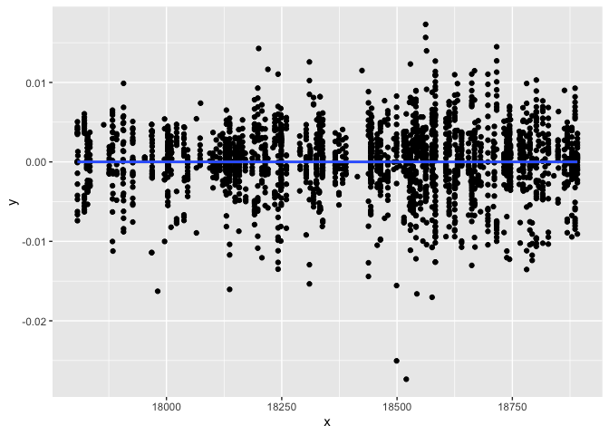<!-- -->

``` r
tibble(y = gam_re_coup_n$fitted.values,x = gam_re_coup_n$y) %>% ggplot(aes(x = x, y =y))+geom_point()+geom_smooth()
```

    ## `geom_smooth()` using method = 'gam' and formula 'y ~ s(x, bs = "cs")'

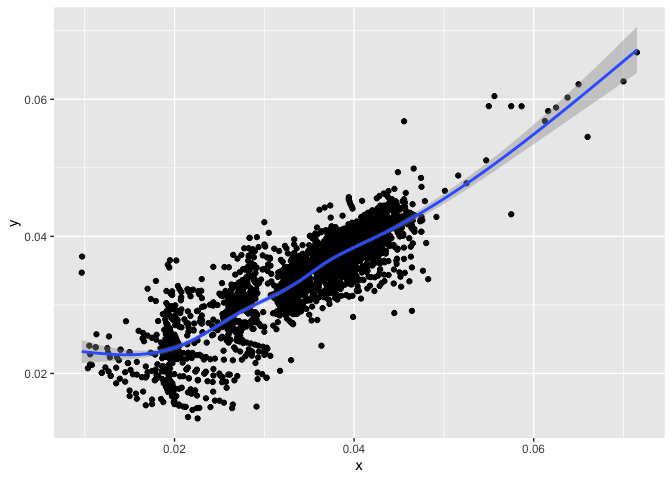<!-- -->

``` r
hist(gam_re_coup_n$residuals)
```

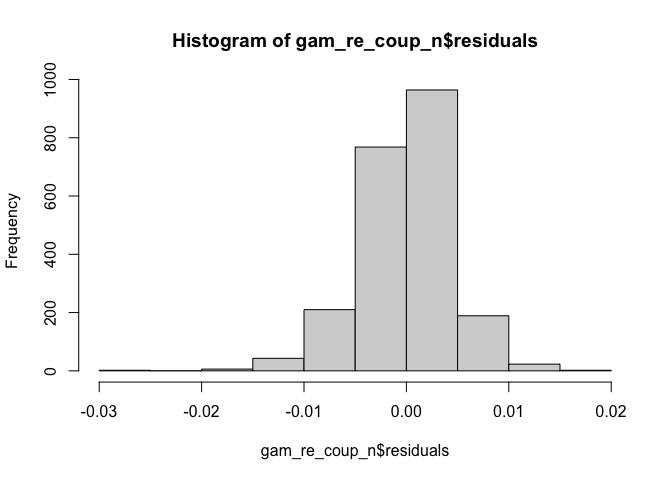<!-- -->

``` r
qqplot(y = gam_re_coup_n$residuals, rnorm(length(gam_re_coup_n$residuals)))
qqline(gam_re_coup_n$residuals)
```

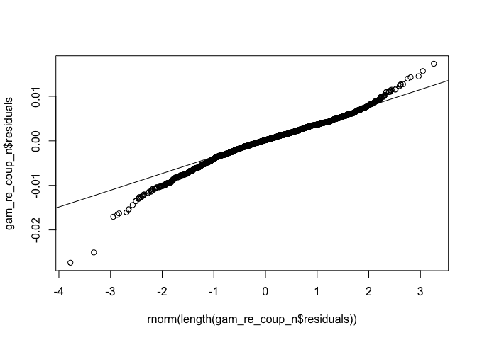<!-- -->

These are, in order, plots looking for autocorrelation, a residual vs
fitted plot, a histogram examining the distribution of the residuals,
and a qqplot.

While all plots conform to expectations, the autocorrelation plot is the
closest to concerning. While there is no autocorrelation in the mean of
the residuals, it’s possible that there is some autocorrelation in the
variance of the residuals. However, the data is not *quite* time series.
We observe issues from issuers. Some of those issuers issue multiple
times throughout our sample period, but our most frequent issuer only
issues 9 times throughout, making time series estimation difficult.

A subsequent possible concern is that correlation between the time
variable and the COVID variable leads to a conflation between our
estimate of COVID and our estimate of the time variable. Because our
results depend on properly estimating the effect of COVID on the coupon
rate, we need to check the degree to which COVID actually contains
useful information.

One way to do this is to compare our Gaussian mixed-effects model that
contains COVID as a regressor against a nested model that does not
contain COVID as a regressor. If the second model proves more
informative, then we have some evidence that our estimate of COVID is
explaining some new variance, as opposed to merely partitioning the
variance already attributed to time.

We can test whether this is the case by a likelihood ratio test between
the two models.

``` r
logLik_no_c <-logLik(gam_re_coup_n_no_c)
logLik_c <-logLik(gam_re_coup_n)

test_stat <- (-2) * (as.numeric(logLik(gam_re_coup_n_no_c))-as.numeric(logLik(gam_re_coup_n)))

pchisq(test_stat, df = 177.7148-174.8757, lower.tail = FALSE)
```

    ## [1] 8.503009e-26

Doing so leads us to reject the null that that the likelihood ratio
between the two models is equal to 1, that is that the goodness of fit
of the two models is identical. This seems to confirm that including
COVID in the model adds to the explained variance of the true coupon
rate.

We can also plot the partial effects plots of the issue_date smooth for
the COVID and no COVID models to see whether there is a difference. No
difference here would mean that adding COVID doesn’t affect our time
estimate, which would imply some conflation between the COVID estimate
and the time estimate. What we see, instead, is the sort of “COVID
penalty” this work attempts to show. The partial smooth for time in the
non-COVID model is, post-COVID, almost everywhere higher than the
partial smooth for the model with COVID included. While the two are
clearly correlated, this plot shows the two being visibly disentangled.

``` r
no_c_p<-visreg(gam_re_coup_n_no_c, "issue_date_d", gg=TRUE)
c_p<-visreg(gam_re_coup_n_s, "issue_date_d",gg=TRUE)

D_plot<-rbind(c_p$data %>% add_column(type = "with covid"),no_c_p$data %>% add_column(type = "wo covid")) %>% mutate(y = as_date(y))

low_cut<-as.numeric(ymd("2019-05-01"))
high_cut<-as.numeric(ymd("2021-10-01"))
D_plot %>% ggplot(aes(x =x , y=y, color = type))+geom_smooth()+xlim(low_cut, high_cut)
```

    ## `geom_smooth()` using method = 'gam' and formula 'y ~ s(x, bs = "cs")'

    ## Warning: Removed 582 rows containing non-finite values (stat_smooth).

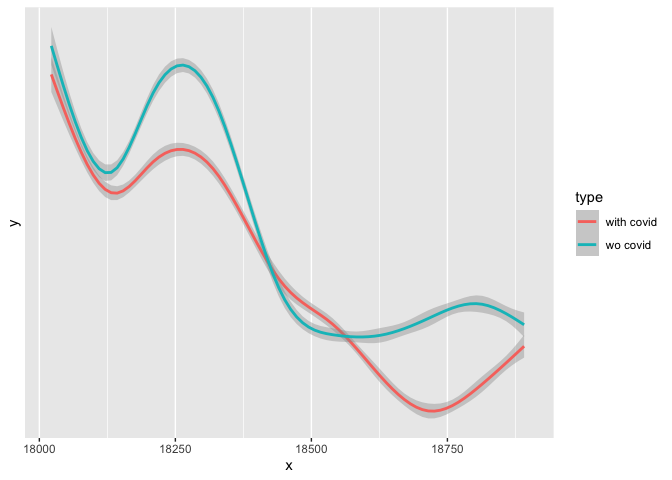<!-- -->

Examination of the COVID-included Gaussian mixed-effects GAM model shows
a variety of sensible inferences that function as sanity checks. The
smooth estimate of the trend over time has a reasonable shape. Likewise,
we estimate that competitive sales will have higher coupons than
negotiated sales, all else constant–a suggestion made to us multiple
times. On the other hand, it is somewhat surprising that callable bonds
are estimated to have lower coupons that non-callable bonds. Looking at
a violin plot of callable bonds v the true coupon seems to confirm that
inference, however.

``` r
D_now %>% ggplot(aes(x = callable, y = true_coupon))+geom_violin()
```

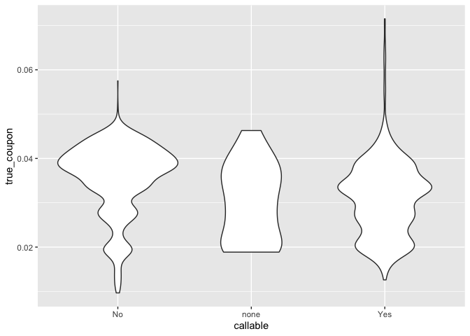<!-- -->

Following Cornaggia (2021), we translate increased bond coupons into the
extra dollar-value payments local governments would pay if bonds were
re-issued. To do this, we take the estimated coefficient for the effect
of COVID on the coupon rate and use it to calculate the coupon rate for
each bond issued post-March 2020 setting COVID equal to zero.

Let the principal owed on bond i be *p*<sub>*i*</sub>, the coupon of
that bond be *c*<sub>*i*</sub>, and the number of years until maturity
*m*<sub>*i*</sub>. Cornaggia, sensibly, tells us to calculate the total
amount of interest cost for that bond as:

*o*<sub>*i*</sub> = *p*<sub>*i*</sub> ⋅ *c*<sub>*i*</sub> ⋅ *m*<sub>*i*</sub>.

We’re interested in estimating what this cost would have looked liked in
the absence of COVID, given an estimate of the effect of COVID on the
coupon rate.

Now, let our estimate of the effect of COVID on the coupon rate be
*β̂*<sub>*c**o**v**i**d*</sub> and let *I*<sub>*i*</sub> be number of
COVID cases in the month prior to the issuance of bond i. Because our
estimate comes from a Poisson model,
*e*<sup>*β̂*<sub>*c**o**v**i**d*</sub></sup> gives us the multiplicative
effect of one extra COVID case on the coupon rate of a bond, given on
the linear scale. We can use the actual number of COVID cases and this
estimate to work backwards from the actual coupon rate for bond i,
*c*<sub>*a*, *i*</sub>, to bond i’s estimated coupon rate without COVID,
*c*<sub>*e*, *i*</sub> as:

*c*<sub>*i*, *e*</sub> = *c*<sub>*i*, *a*</sub> ⋅ *e*<sup>−*β̂*<sub>*c**o**v**i**d*</sub> ⋅ *I*<sub>*i*</sub></sup>

giving the new amount of interest due as:

*o*<sub>*i*, *e*</sub> = *c*<sub>*i*, *a*</sub> ⋅ *e*<sup>−*β̂*<sub>*c**o**v**i**d*</sub> ⋅ *I*<sub>*i*</sub></sup> ⋅ *p*<sub>*i*</sub> ⋅ *m*<sub>*i*</sub>

and the difference between the actual and COVID-less estimate as:

$$
d\_{i} =  o\_{i,a}-o\_{i,e}\\\\
 =  p\_{i} \\cdot m\_{i} \\cdot (c\_{i,a}-c\_{i,a}\\cdot e^{-\\hat{\\beta}\_{covid} \\cdot I\_{i}})\\\\
 =   p\_{i} \\cdot m\_{i} \\cdot c\_{i,a} \\cdot (1-e^{-\\hat{\\beta}\_{covid} \\cdot I\_{i}})
$$

By summing this quantity up over i, where i indexes the bonds issued
post-COVID, we can reach an estimate for the total extra interest cost
borne by issuers paying higher coupons post-COVID. We can also translate
the MLE SE into MLE lower and upper confidence bounds for the estimates.

``` r
del_yield_covid_p_re_k<-gam_re_coup_p_k$coefficients[which(names(gam_re_coup_p_k$coefficients)=="I_s")]

Vcv_p_re_k <- vcov(gam_re_coup_p_k, unconditional = TRUE)
V_p_re_k <- sqrt(diag(Vcv_p_re_k))
se_p_re_k<-V_p_re_k[which(names(gam_re_coup_p_k$coefficients)=="I_s")]
ci_h_p_re_k <- del_yield_covid_p_re_k+1.96*se_p_re_k
ci_l_p_re_k <- del_yield_covid_p_re_k-1.96*se_p_re_k

##
del_yield_covid_n_re_k<-gam_re_coup_n_k$coefficients[which(names(gam_re_coup_n_k$coefficients)=="I_s")]

Vcv_n_re_k <- vcov(gam_re_coup_n_k, unconditional = TRUE)
V_n_re_k <- sqrt(diag(Vcv_n_re_k))
se_n_re_k<-V_n_re_k[which(names(gam_re_coup_n_k$coefficients)=="I_s")]
ci_h_n_re_k <- del_yield_covid_n_re_k+1.96*se_n_re_k
ci_l_n_re_k <- del_yield_covid_n_re_k-1.96*se_n_re_k

##
del_yield_covid_p_re<-gam_re_coup_p$coefficients[which(names(gam_re_coup_p$coefficients)=="I_s")]

Vcv_p_re <- vcov(gam_re_coup_p, unconditional = TRUE)
V_p_re <- sqrt(diag(Vcv_p_re))
se_p_re<-V_p_re[which(names(gam_re_coup_p$coefficients)=="I_s")]
ci_h_p_re <- del_yield_covid_p_re+1.96*se_p_re
ci_l_p_re <- del_yield_covid_p_re-1.96*se_p_re

##
del_yield_covid_n_re<-gam_re_coup_n$coefficients[which(names(gam_re_coup_n$coefficients)=="I_s")]

Vcv_n_re <- vcov(gam_re_coup_n, unconditional = TRUE)
V_n_re <- sqrt(diag(Vcv_n_re))
se_n_re<-V_n_re[which(names(gam_re_coup_n$coefficients)=="I_s")]
ci_h_n_re <- del_yield_covid_n_re+1.96*se_n_re
ci_l_n_re <- del_yield_covid_n_re-1.96*se_n_re

##
del_yield_covid_p<-gam_fe_coup_p$coefficients[which(names(gam_fe_coup_p$coefficients)=="I_s")]

Vcv_p_fe <- vcov(gam_fe_coup_p, unconditional = TRUE)
V_p_fe <- sqrt(diag(Vcv_p_fe))
se_p_fe<-V_p_fe[which(names(gam_fe_coup_p$coefficients)=="I_s")]
ci_h_p_fe <- del_yield_covid_p+1.96*se_p_fe
ci_l_p_fe <- del_yield_covid_p-1.96*se_p_fe

#
del_yield_covid_n<-gam_fe_coup_n$coefficients[which(names(gam_fe_coup_n$coefficients)=="I_s")]

Vcv_n_fe <- vcov(gam_fe_coup_n, unconditional = TRUE)
V_n_fe <- sqrt(diag(Vcv_n_fe))
se_n_fe<-V_n_fe[which(names(gam_fe_coup_n$coefficients)=="I_s")]
ci_h_n_fe <- del_yield_covid_n+1.96*se_n_fe
ci_l_n_fe <- del_yield_covid_n-1.96*se_n_fe

#
del_yield_covid_lm<-lm_coup_g$coefficients[which(names(lm_coup_g$coefficients)=="I_s")]

Vcv_lm <- vcov(lm_coup_g, unconditional = TRUE)
V_lm <- sqrt(diag(Vcv_lm))
se_lm<-V_lm[which(names(lm_coup_g$coefficients)=="I_s")]
ci_h_lm <- del_yield_covid_lm+1.96*se_lm
ci_l_lm <- del_yield_covid_lm-1.96*se_lm

#this comes from looking at the difference between the amount due under the current true coupon (time to maturity * amount of loan * true coupon as it is) and the amount due under the estimated hypothetical coupon where there was no covid (time to maturity * amount of loan * true coupon as it is * e^(-estimate*covid cases))

extra_interest_p_re_k<-D_now %>% filter(issue_date>as.numeric(ymd("2020-03-01"))) %>%
  mutate(actual_price =principal_amount_at_issuance/(dollar_price/100),
         mult = exp(del_yield_covid_p_re_k)^(-I_s),
         mult_high = exp(ci_h_p_re_k)^(-I_s),
         mult_low = exp(ci_l_p_re_k)^(-I_s)) %>% 
  select(actual_price, ttm, mult,mult_high,mult_low,true_coupon,I_s) %>% 
  mutate(
    k = ttm*actual_price*true_coupon*(1-mult),
    k_high=ttm*actual_price*true_coupon*(1-mult_high),
    k_low=ttm*actual_price*true_coupon*(1-mult_low))%>% group_by() %>% 
  summarise(d=sum(k), d_low = sum(k_low),d_high = sum(k_high)) %>% 
  add_column(model = "p gam re k", .before=1)

extra_interest_n_re_k<-D_now %>% filter(issue_date>as.numeric(ymd("2020-03-01"))) %>%
  mutate(actual_price =principal_amount_at_issuance/(dollar_price/100),
         mult = (del_yield_covid_n_re_k)*(I_s),
         mult_high = (ci_h_n_re_k)*(I_s),
         mult_low = (ci_l_n_re_k)*(I_s)) %>% 
  select(actual_price, ttm, mult,mult_high,mult_low,true_coupon,I_s) %>% 
  mutate(
    k = ttm*actual_price*mult,
    k_high = ttm*actual_price*mult_high,
    k_low = ttm*actual_price*mult_low) %>% group_by() %>% 
  summarise(d=sum(k), d_low = sum(k_low),d_high = sum(k_high)) %>% 
  add_column(model = "n gam re k", .before=1)

extra_interest_p_re<-D_now %>% filter(issue_date>as.numeric(ymd("2020-03-01"))) %>%
  mutate(actual_price =principal_amount_at_issuance/(dollar_price/100),
         mult = exp(del_yield_covid_p_re)^(-I_s),
         mult_high = exp(ci_h_p_re)^(-I_s),
         mult_low = exp(ci_l_p_re)^(-I_s)) %>% 
  select(actual_price, ttm, mult,mult_high,mult_low,true_coupon,I_s) %>% 
  mutate(
    k = ttm*actual_price*true_coupon*(1-mult),
    k_high=ttm*actual_price*true_coupon*(1-mult_high),
    k_low=ttm*actual_price*true_coupon*(1-mult_low)) %>% group_by() %>% 
  summarise(d=sum(k), d_low = sum(k_low),d_high = sum(k_high)) %>% 
  add_column(model = "p gam re", .before=1)

extra_interest_n_re<-D_now %>% filter(issue_date>as.numeric(ymd("2020-03-01"))) %>%
  mutate(actual_price =principal_amount_at_issuance/(dollar_price/100),
         mult = (del_yield_covid_n_re)*(I_s),
         mult_high = (ci_h_n_re)*(I_s),
         mult_low = (ci_l_n_re)*(I_s)
         ) %>% 
  select(actual_price, ttm, mult,mult_high,mult_low,true_coupon,I_s) %>% 
  mutate(
    k = ttm*actual_price*mult,
    k_high = ttm*actual_price*mult_high,
    k_low = ttm*actual_price*mult_low
    ) %>% group_by() %>% 
  summarise(d=sum(k), d_low = sum(k_low),d_high = sum(k_high)) %>% 
  add_column(model = "n gam re", .before=1)

extra_interest_p<-D_now %>% filter(issue_date>as.numeric(ymd("2020-03-01"))) %>%
  mutate(actual_price =principal_amount_at_issuance/(dollar_price/100),
         mult = exp(del_yield_covid_p)^(-I_s),
         mult_high = exp(ci_h_p_fe)^(-I_s),
         mult_low = exp(ci_l_p_fe)^(-I_s)) %>% 
  select(actual_price, ttm, mult,mult_high,mult_low,true_coupon,I_s) %>% 
  mutate(
    k = ttm*actual_price*true_coupon*(1-mult),
    k_high=ttm*actual_price*true_coupon*(1-mult_high),
    k_low=ttm*actual_price*true_coupon*(1-mult_low))%>% group_by() %>% 
  summarise(d=sum(k), d_low = sum(k_low),d_high = sum(k_high)) %>% 
  add_column(model = "p gam fe", .before=1)

extra_interest_n<-D_now %>% filter(issue_date>as.numeric(ymd("2020-03-01"))) %>%
  mutate(actual_price =principal_amount_at_issuance/(dollar_price/100),
         mult = (del_yield_covid_n)*(I_s),
         mult_high = (ci_h_n_fe)*(I_s),
         mult_low = (ci_l_n_fe)*(I_s)) %>% 
  select(actual_price, ttm, mult,mult_high,mult_low,true_coupon,I_s) %>% 
  mutate(
    k = ttm*actual_price*mult,
    k_high = ttm*actual_price*mult_high,
    k_low = ttm*actual_price*mult_low)  %>% group_by() %>% 
  summarise(d=sum(k), d_low = sum(k_low),d_high = sum(k_high)) %>% 
  add_column(model = "n gam fe", .before=1)

extra_interest_lm<-D_now %>% filter(issue_date>as.numeric(ymd("2020-03-01"))) %>%
  mutate(actual_price =principal_amount_at_issuance/(dollar_price/100),
         mult = (del_yield_covid_lm)*(I_s),
         mult_high = (ci_h_lm)*(I_s),
         mult_low = (ci_l_lm)*(I_s)) %>% 
  select(actual_price, ttm, mult,mult_high,mult_low,true_coupon,I_s) %>%
  mutate(
    k = ttm*actual_price*mult,
    k_high = ttm*actual_price*mult_high,
    k_low = ttm*actual_price*mult_low)  %>% group_by() %>% 
  summarise(d=sum(k), d_low = sum(k_low),d_high = sum(k_high)) %>% 
  add_column(model = "lm", .before=1)

D_ests<-rbind(extra_interest_n_re_k,
extra_interest_p_re_k,
extra_interest_p_re,
extra_interest_n_re,
extra_interest_p,
extra_interest_n,
extra_interest_lm) %>% mutate(model = as_factor(model))

D_ests$model<- factor(D_ests$model, levels = c("lm","n gam fe","p gam fe","n gam re", "p gam re", "n gam re k", "p gam re k"))

D_ests %>% ggplot(aes(x = model, y = d))+geom_point()+
  geom_errorbar(aes(ymin = d_low, ymax = d_high))+ylim(0,8*10^8)+
  ylab("Estimated effect of COVID")+xlab("model")
```

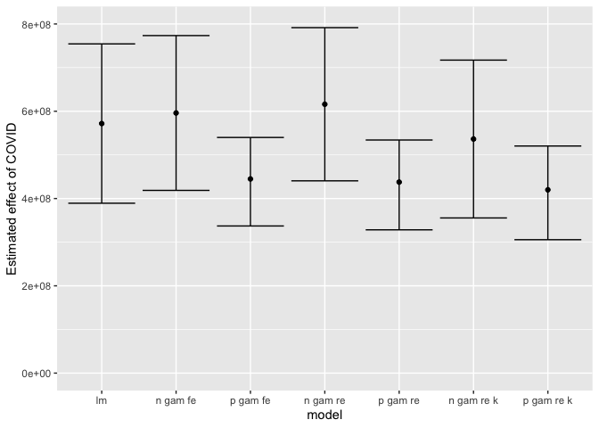<!-- -->

``` r
D_ests %>% filter(model!="lm") %>% group_by() %>% summarise(d = mean(d), d_low = mean(d_low), d_high = mean(d_high))
```

    ## # A tibble: 1 x 3
    ##            d      d_low     d_high
    ##        <dbl>      <dbl>      <dbl>
    ## 1 508502995. 364316274. 646105005.

If we take the estimates from our Gaussian mixed effects model, we get
estimates of the cost of COVID due to increased interest rates between
about $438 million and $789 million, with a point estimate at $613
million.

Likewise, we can exclude the linear model from the estimates and take an
average of model results to see that a range of about $357 million to
$639 million, with a point estimate at $501 million.

## Acknoledgements

Many thanks to The Brown Institute for Media Innovation at Columbia
University and The Pulitzer Center for the grants that made this work
possible. Special thanks to Mark Hansen and Juan Saldarriaga of the
Brown Institute and Boyoung Lim of the Pulitzer Center for their help
and guidance, to Mark Lavine, professor of statistics at the University
of Massachussetts Amerst, for statistical consulting and methodological
vetting, to Ken Foskett, former editor at the Atlanta
Journal-Constitution, for editing throughout, to J. Scott Trubey of the
Atlanta Journal-Constitution for reporting, and to John Perry of the
Atlanta Journal-Constitution for data scraping.
